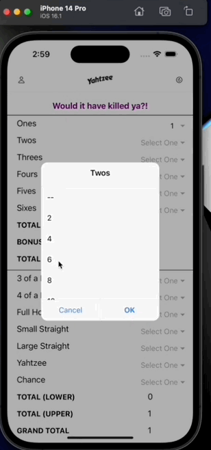
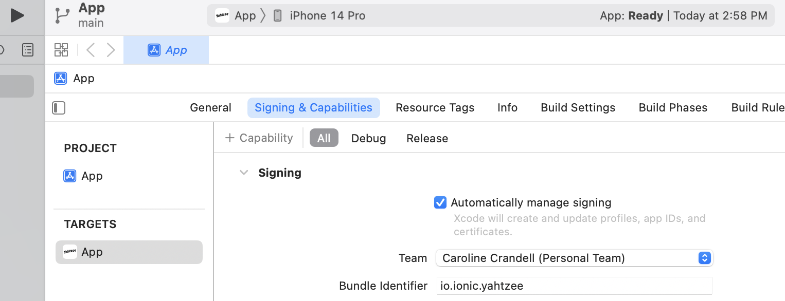

# Yahtzee Scorecard

**What does this app do and why?**

The Yahtzee Scorecard passion project is a mobile app built using the Ionic framework and React for the frontend. It came about because the creator's parents having been playing Yahtzee for 30+ years, and they are ever conscious of the amount of paper and ink they use on keeping score.

While a digital scorecard would eliminate gifting her parents with Yahtzee notepads for their birthdays, the creator set out to make a mobile app that enables users to:

- Input their name
- Input their score for each turn
- Provide feedback at the top of the scorecard for each turn
- Automatically tally the whole scorecard with each new input
- Automatically calculate the bonus
- Restart the game



Find the full demo here on [YouTube](https://www.youtube.com/watch?v=oexg46TRvtY).

**How the app is organised**

- **.gitignore** - indicates which files to omit from this GitHub repository, such as the `ios` and `build` folders
- **Assets.xcassets folder** - (in the `.gitignore`) contains brand materials such as the icon of the app for various screen sizes and devices
- **build folder** - (in the `.gitignore`) contains files to deploy the app locally
- **images folder** - (in the `.gitignore`) contains images for the app
- **ios folder** - (in the `.gitignore`) contains files to launch the app on an iOS device
- **node_modules folder** - (in the `.gitignore`) contains the dependencies to run the app
- **public** - contains the static files, including `index.html`
- **src** - contains all of the functionality and design of the app
- **support folder** - contains the media files for this `README` file
- **capacitor.config.json** - contains high-level code for Capacitor tooling
- **ionic.config.json** - contains code for global configuration
- **package-lock.json** - (in the `.gitignore`) contains list of what dependencies are installed
- **package.json** - contains instructions for what dependencies `npm` needs to install
- **README** - this document, providing background information for the app
- **tsconfig.json** - contains code for compiler options

**Step-by-Step on how to run the app (currently macOS only)**

First clone this app repository onto your computer. Open your Terminal and navigate to where you would like to download the source code. Then for `SSH`, run:

```js
git clone git@github.com:cecrandell/yahtzee.git
```

Or for `HTTPS`, run:

```js
git clone https://github.com/cecrandell/yahtzee.git
```

Now that you have downloaded the app onto your computer, please ensure that you have [Ionic](https://ionicframework.com/docs/intro/cli) and [npm](https://docs.npmjs.com/downloading-and-installing-node-js-and-npm) installed on your computer. Then navigate to the root folder in your Terminal and run:

```js
npm install
```

To run locally, run:

```js
ionic serve
```

To run in an iOS simulator, run:

```js
ionic build
```

Then run:

```js
ionic cap add ios
```

To open in Xcode, run:

```js
ionic cap open ios
```

Once you are in Xcode, you will need to configure your Apple ID as your Team and change your Bundle Identifier from `io.ionic.starter` to `io.ionic.<app-name>` (see screenshot below for an example):



Then select your preferred simulator device and press the play button to run the app in a simulator.

**Technologies Used**

- Ionic
- React
- JavaScript
- Typescript
- HTML
- CSS

**Developer**

- Caroline Crandell - cecrandell - cecrandell19@gmail.com - [LinkedIn](https://www.linkedin.com/in/carolinecrandell/)
